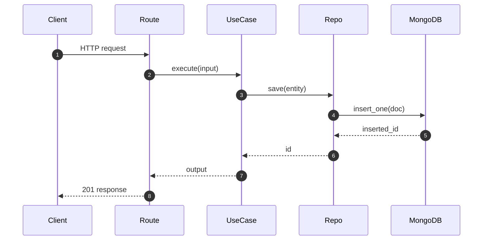

# Design Feature — Fase 2 do SDD

> Cria `.specs/features/<slug>/design.md` com decisões arquiteturais antes de implementar.
> **Só aciona** para escopo Large ou Complex.

---

## Quando usar

- Spec aprovado.
- Feature toca 3+ camadas (domain + application + infrastructure + tests).
- Introduz padrão novo, domínio novo ou integra com API externa nova.
- Tem trade-off arquitetural relevante.

**Pular Design** se:
- Caminho de implementação é óbvio a partir do spec.
- Reusa padrões existentes (mais um use case CRUD, mais um endpoint proxy).

---

## Estrutura do `design.md`

```markdown
# design: <slug>

> Spec: ./spec.md
> Status: draft | approved | implementing | done
> Criado em: YYYY-MM-DD

## Resumo executivo

<3-5 linhas. Abordagem escolhida em alto nível.>

## Componentes

| Componente               | Tipo         | Local                                            | Responsabilidade |
|--------------------------|--------------|--------------------------------------------------|------------------|
| `<Nome>UseCase`          | Application  | `src/application/use_cases/<dominio>/`           | <one-liner>      |
| `I<Nome>Repository`      | Domain       | `src/domain/repositories/`                       | <one-liner>      |
| `MongoDB<Nome>Repository`| Infra        | `src/infrastructure/persistence/repositories/`   | <one-liner>      |

## Fluxo



## Decisões arquiteturais

### D-<slug>-1: <decisão curta>

**Contexto:** <por que esta decisão precisou ser tomada>
**Decisão:** <o que foi decidido>
**Trade-off:** <o que se sacrifica>

## Reuso

| Componente existente | Como reusar |
|----------------------|-------------|
| `ExampleEntity`      | Herdar ou adaptar |

## Arquivos a criar/modificar

| Arquivo | Ação | Notas |
|---------|------|-------|
| `src/domain/entities/novo.py` | criar | dataclass puro |
| `src/domain/repositories/novo_repository.py` | criar | interface ABC |
```

---

## Stop point

Apresentar o design ao usuário. Aguardar aprovação antes de Tasks ou Execute.
