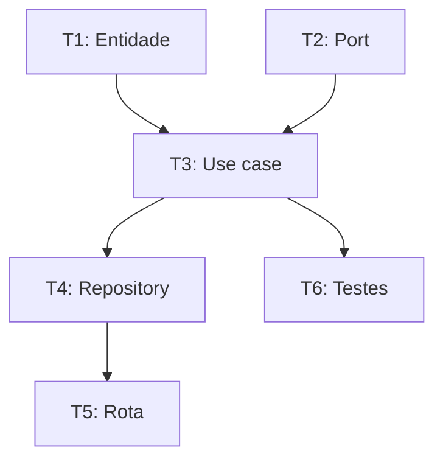

# Tasks Breakdown — Fase 3 do SDD

> Cria `.specs/features/<slug>/tasks.md` com tasks atômicas, dependências explícitas e gates.
> Pula quando há <= 5 passos óbvios sem dependências.

---

## Quando usar

- Spec (e Design, se Large/Complex) aprovados.
- Feature tem **>= 6 passos** OU dependências entre passos.
- Beneficia de execução paralela parcial.

**Pular Tasks** quando:
- Feature Medium com 3-5 passos lineares.
- Quick mode.

---

## Estrutura do `tasks.md`

```markdown
# tasks: <slug>

> Spec: ./spec.md
> Design: ./design.md (opcional)
> Status: draft | approved | in-progress | done
> Criado em: YYYY-MM-DD

## Resumo

<Total: N tasks. Paralelizáveis: M. Caminho crítico: T1 -> T3 -> T5.>

## Dependências



## Tasks

### T1: <título curto> `[P]`

- **REQ cobertos:** 1, 2
- **Arquivos:** `src/domain/entities/foo.py` (novo)
- **Reuso:** `src/domain/entities/example.py` (template)
- **Depends on:** -
- **Done when:**
  - [ ] Entidade criada como `dataclass`
  - [ ] Tipos completos
- **Tests:** `poetry run pytest tests/unit/domain/entities/test_foo.py -v`
- **Gate:** `make unit` passa
- **Status:** pending | in-progress | done | blocked
```

---

## Marcadores

- `[P]` — paralelizável (não depende de nenhuma task in-progress)
- `[SEQ]` — sequencial (bloqueia tasks seguintes)
- `[GATE]` — gate obrigatório antes de continuar o pipeline
